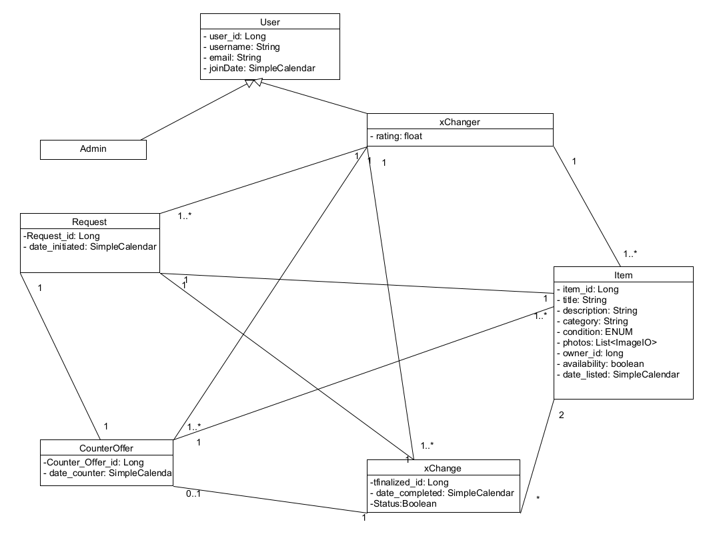

# Διάγραμμα Κλάσεων με Σχέσεις

## Χρήστης (User)
- **Ιδιότητες:**
  - `user_id: Long` - Μοναδικό αναγνωριστικό για κάθε χρήστη.
  - `username: String` - Όνομα χρήστη που επιλέγει ο χρήστης.
  - `email: String` - Διεύθυνση email του χρήστη.
  - `joinDate: LocalDate()` - Ημερομηνία εγγραφής του χρήστη στην πλατφόρμα.

## Διαχειριστής (Admin)
- **Ιδιότητες:** Κληρονομεί όλες τις ιδιότητες του user.

## xChanger
- **Ιδιότητες:**
  - `rating: float` - Αξιολόγηση του χρήστη στην εφαρμογή.

## Αντικείμενο (Item)
- **Ιδιότητες:**
  - `item_id: Long` - Μοναδικό αναγνωριστικό για κάθε αντικείμενο.
  - `title: String` - Τίτλος αντικειμένου.
  - `description: String` - Περιγραφή του αντικειμένου.
  - `category: String` - Κατηγορία στην οποία ανήκει το αντικείμενο (π.χ., ηλεκτρονικά, ρούχα).
  - `condition: ENUM` - Κατάσταση του αντικειμένου (π.χ., καινούργιο, μεταχειρισμένο).
  - `photos: List<ImageIO>` - Λίστα φωτογραφιών του αντικειμένου.
  - `owner_id: long` - Αναγνωριστικό του χρήστη που κατέχει το αντικείμενο.
  - `availability: boolean` - Δείχνει αν το αντικείμενο είναι διαθέσιμο για ανταλλαγή.
  - `date_listed: LocalDate()` - Ημερομηνία που καταχωρήθηκε το αντικείμενο στην πλατφόρμα.

## Αίτημα (Request)
- **Ιδιότητες:**
  - `request_id: Long` - Μοναδικό αναγνωριστικό για κάθε αίτημα.
  - `date_initiated: LocalDate()` - Ημερομηνία δημιουργίας του αιτήματος.

## Αντιπροσφορά (CounterOffer)
- **Ιδιότητες:**
  - `counter_offer_id: Long` - Μοναδικό αναγνωριστικό για κάθε αντιπροσφορά.
  - `date_counter: LocalDate()` - Ημερομηνία δημιουργίας της αντιπροσφοράς.

## Ολοκλήρωση (Finalized)
- **Ιδιότητες:**
  - `finalized_id: Long` - Μοναδικό αναγνωριστικό για κάθε ολοκληρωμένη συναλλαγή.
  - `date_completed: LocalDate()` - Ημερομηνία ολοκλήρωσης της συναλλαγής.
  - `status: Boolean` - Δείχνει αν η συναλλαγή έχει ολοκληρωθεί επιτυχώς.

---

### Σύνοψη των Σχέσεων
- **Χρήστης-Διαχειριστής**: Σχέση Ένα προς Μηδέν ή Ένα, όπου ένας διαχειριστής είναι χρήστης, αλλά κάθε χρήστης δεν είναι διαχειριστής.
- **Χρήστης-xChanger**: Σχέση Ένα προς Ένα, που αντιπροσωπεύει το κύριο προφίλ του χρήστη στο σύστημα ανταλλαγής.
- **xChanger-Αντικείμενο**: Σχέση Ένα προς Ένα ή περισσότερα, όπου κάθε χρήστης μπορεί να κατέχει πολλαπλά αντικείμενα, αλλά κάθε αντικείμενο αντιστοιχεί σε έναν μόνο χρήστη.
- **Request-Item**: Σχέση Ένα προς Ένα ή περισσότερα, όπου κάθε αίτημα μπορεί να περιλαμβάνει ένα ή περισσότερα αντικείμενα.
- **Request-CounterOffer**: Σχέση Ένα προς Ένα ή περισσότερα, όπου ένα αίτημα μπορεί να λάβει μία ή περισσότερες αντιπροσφορές.
- **CounterOffer-Finalized**: Σχέση Ένα προς Ένα ή περισσότερες, όπου κάθε αντιπροσφορά μπορεί να οδηγήσει σε μία ή περισσότερες ολοκληρωμένες συναλλαγές.
- **Finalized-Item**: Σχέση Ένα προς Ένα ή περισσότερες, όπου κάθε ολοκληρωμένη συναλλαγή περιλαμβάνει ένα ή περισσότερα αντικείμενα.

