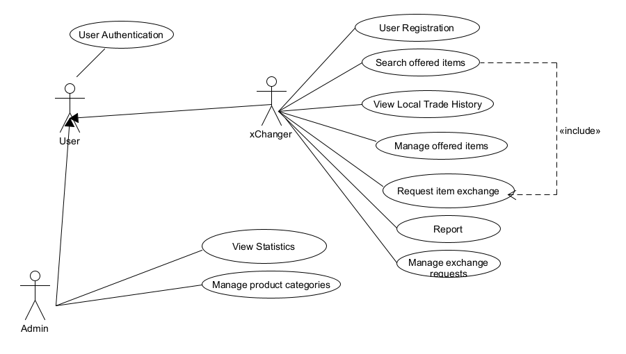

# Εισαγωγή

Το παρόν έγγραφο παρέχει μια λεπτομερή περιγραφή του συστήματος **xChange**, που είναι μια εφαρμογή για ανταλλαγή αντικειμένων μεταξύ χρηστών χωρίς τη χρήση χρημάτων. Το έγγραφο παρουσιάζει τις λειτουργικές και μη λειτουργικές απαιτήσεις, τη δομή του συστήματος και τους επιχειρησιακούς κανόνες, με στόχο την ανάπτυξη του λογισμικού σε Android πλατφόρμα και χρήση Firebase για βάση δεδομένων.

## Εμβέλεια

Το **xChange** θα επιτρέπει στους χρήστες να:
- Δημιουργούν λογαριασμό και προφίλ
- Ανεβάζουν αντικείμενα για ανταλλαγή
- Πραγματοποιούν συναλλαγές αντικειμένων με άλλους χρήστες της πλατφόρμας
- Στέλνουν αιτήματα ανταλλαγών
- Βλέπουν το ιστορικό συναλλαγών τους
- Αξιολογούν άλλους χρήστες με βάση τις υπηρεσίες τους

**Περιορισμοί**:
- Ο χρήσης δεν θα μπορεί να πλοηγηθεί στην πλατφόρμα και να πραγματοποιεί ανταλλαγές προϊόντων αν δεν διαθέτει λογαριασμό

## Ορισμοί, Ακρωνύμια και Συντομογραφίες

| Ακρωνύμιο | Περιγραφή                                      |
|-----------|-----------------------------------------------|
| ΕΠΑΛ      | Έγγραφο Προδιαγραφών Απαιτήσεων Λογισμικού    |
| DB        | Βάση Δεδομένων                                |
| UI        | User Interface                                |
| ID        | Αναγνωριστικό                                 |

## Αναφορές

- Android Studio Documentation
- Firebase Documentation

## Επισκόπηση

Το έγγραφο αποτελείται από τις παρακάτω ενότητες:
- Συνολική περιγραφή του συστήματος και των λειτουργιών
- Ειδικές απαιτήσεις και περιπτώσεις χρήσης
- Επιχειρησιακοί κανόνες και ποιοτικά χαρακτηριστικά

---

## Επισκόπηση Μοντέλου Περιπτώσεων Χρήσης

### Πίνακας Περιπτώσεων Χρήσης

| Κωδικός                                | Τίτλος                  | Περιγραφή                                                    |
|----------------------------------------|--------------------------|--------------------------------------------------------------|
| ΠΧ1                                    | Δημιουργία Λογαριασμού   | Ο χρήστης εγγράφεται στο xChange και δημιουργεί προφίλ       |
| [ΠΧ2](./use-case_upload.md)            | Ανέβασμα Αντικειμένου    | Ο χρήστης ανεβάζει ένα αντικείμενο για ανταλλαγή και το διαχερίζεται             |
| ΠΧ3                                    | Αναζήτηση Αντικειμένων   | Ο χρήστης αναζητά η ψάχνει διαθέσιμα αντικείμενα για ανταλλαγή        |
| [ΠΧ4](./use-case_trade.md)             | Συναλλαγή Ανταλλαγής     | Ο χρήστης στέλνει αίτημα για ανταλλαγή αντικειμένου με άλλον χρήστη |
| ΠΧ5                                    | Ιστορικό Συναλλαγών      | Ο χρήστης μπορεί να δει το ιστορικό των συναλλαγών του       |
| ΠΧ6                                    | Αναφορά ανεπιθύμητης συμπεριφοράς       | Ο εκάστοτε χρήστης μπορεί να αναφέρει κάποιον χρήστη σε περίπτωση απάτης, μη συμμόρφωσης με τους κανόνες συμπεριφοράς της πλατφόρμας |
| [ΠΧ7](./use-case_trade_management.md)  | Αποδοχή ή Απόρριψη Αιτήματος Ανταλλαγής | Ο αποδέκτης επιλέγει να αποδεχτεί, να απορρίψει ή να κάνει αντιπρόταση στο αίτημα |
| ΠΧ8                                    | Παρακολούθηση Στατιστικών και Συναλλαγών από Διαχειριστή | Ο διαχειριστής μπορεί να δει όλες τις συναλλαγές (ολοκληρωμένες και μη), καθώς και κάποια μεμονωμένα στατιστικά για την χρήση της εφαρμογής |
| ΠΧ9                                    | Διαχείριση κατηγοριών | Ο διαχειρστής θα μπορεί να προσθέτει και να αφαιρεί κατηγορίες προιόντων        |
| [ΠΧ10](./use-case_trade_management.md) | Τροποποίηση αιτημάτων - Αίτημα Αντιπροσφοράς | Ο χρήστης θα έχει την δυνατότητα να ζητήσει διαφορετικό προϊόν από το προσφερόμενο          |

---

### Μη λειτουργικές Απαιτήσεις

Οι μη λειτουργικές απαιτήσεις για την εφαρμογή **xChange** έχουν ως στόχο να διασφαλίσουν την προστασία και την ασφάλεια των χρηστών, καθώς και την παροχή μιας ευχάριστης και φιλικής προς τον χρήστη εμπειρίας.

1. **Προστασία Χρηστών**
    * **Καταγγελία Απάτης**: Το σύστημα πρέπει να διαθέτει μηχανισμό αναφοράς απάτης ή κακόβουλης συμπεριφοράς, επιτρέποντας στους χρήστες να αναφέρουν περιπτώσεις ανεπιθύμητης ή ύποπτης δραστηριότητας.
    * **Ασφάλεια Συναλλαγών**: Δεδομένου ότι η πλατφόρμα επικεντρώνεται στην ανταλλαγή αντικειμένων χωρίς χρηματικές συναλλαγές, οι χρήστες είναι προστατευμένοι από οικονομική απώλεια σε περίπτωση απάτης.

2. **Ασφάλεια Δεδομένων Χρηστών**
    * **Κρυπρογράφηση Συνθηματικών**: Τα συνθηματικά των χρηστών πρέπει να αποθηκεύονται σε κρυπτογραφημένη μορφή, χρησιμοποιώντας σύγχρονες μεθόδους κατακερματισμού (hashing) και salting, ώστε να είναι μη ανακτήσιμα σε περίπτωση παραβίασης δεδομένων.
    * **Προστασία απο Κακόβουλο Λογισμικό**: Σε περίπτωση εισβολής κακόβουλου λογισμικού, η εφαρμογή θα περιλαμβάνει μηχανισμούς προστασίας και παρακολούθησης για την αποτροπή πρόσβασης σε προσωπικά δεδομένα των χρηστών.

3. **Ευχρηστία (Usability)**
    * **Φιλικό UI**: Η εφαρμογή θα διαθέτει φιλικό και εύχρηστο περιβάλλον εργασίας, ώστε οι χρήστες να μπορούν να πλοηγούνται και να ολοκληρώνουν τις ανταλλαγές τους χωρίς δυσκολία.
    * **Ευχάριστη Εμπειρία Χρήσης**: Το UI σχεδιάζεται με γνώμονα την απλότητα και τη λειτουργικότητα, παρέχοντας μια ευχάριστη και άμεση εμπειρία στους χρήστες.

4. **Επεκτασιμότητα και Συντήρηση**
    * **Ευκολία Αναβαθμισης**: Το σύστημα θα μπορεί εύκολα να αναβαθμιστεί για να υποστηρίξει περισσότερους χρήστες και νέες λειτουργίες χωρίς σημαντική τροποποίηση.

### Οι Ενδιαφερόμενοι και οι Ανάγκες τους

| Ενδιαφερόμενος | Ανάγκες                                                |
|----------------|-------------------------------------------------------|
| Χρήστης        | Ανταλλαγή αντικειμένων με άλλους χρήστες               |
| Διαχειριστής   | Προβολή στατιστικών και συναλλαγών   |

### Actors του Συστήματος

| Actor       | Περιγραφή                                                               |
|-------------|-------------------------------------------------------------------------|
| xChanger    | Τακτικός χρήστης της εφαρμογής που ανεβάζει και ανταλλάσσει αντικείμενα |
| Admin       | Χρήστης με δικαιώματα διαχειριστή |

---

## Συμπληρωματικές Προδιαγραφές

### Απαιτήσεις Διεπαφών

#### Διεπαφές Χρήστη
- Εύχρηστη και κατανοητή διάταξη για κινητές συσκευές.

#### Διεπαφές Λογισμικού
- Firebase για αποθήκευση δεδομένων χρηστών, αντικειμένων και συναλλαγών.

### Περιορισμοί Σχεδίασης και Υλοποίησης
- Η εφαρμογή πρέπει να λειτουργεί σε εκδόσεις Android 9.0 και πάνω.

### Ποιοτικά Χαρακτηριστικά

| Χαρακτηριστικό  | Περιγραφή                                                     |
|-----------------|---------------------------------------------------------------|
| Απόδοση         | Γρήγορη ανταπόκριση στην αναζήτηση και στο ανέβασμα αντικειμένων |
| Διαθεσιμότητα   | Η πλατφόρμα είναι διαθέσιμη 99% του χρόνου                    |
| Ασφάλεια        | Προστασία δεδομένων χρηστών με χρήση ασφαλούς σύνδεσης        |
| Ευελιξία        | Εύκολη προσαρμογή για μελλοντικές αναβαθμίσεις               |

---

# Υποστηρικτικό Υλικό
1. Android Studio, εκεί είναι ανεπτυγμένο όλο το project.
2. Firebase, οπυ χρησιμοποιείται για την βάση δεδομένων, χρήση αναλυτικών και παροχή διαφόρων βοηθειών όπως ταυτοποίηση χρηστών.
3. Gitlab, οπου εδώ ανεβάζουμε τα αρχεία που χρειάζεται η ομάδα για να

## Επιχειρησιακοί Κανόνες

| Επιχειρησιακοί Κανόνες | Περιγραφή                                                                            |
|------------------------|--------------------------------------------------------------------------------------|
| ΕΚ1                    | Κάθε χρήστης οφείλει να σεβασεί τον σκοπό της εφαρμογής και να μην ανεβάζει παράνομα, βλαβερά προς τον άλλον αντικείμενα, προσωπικά στοιχεία ανθρώπων κλπ.          |
| ΕΚ2                    | Μόνο οι εγγεγραμμένοι χρήστες μπορούν να στέλνουν ή να λαμβάνουν αιτήματα ανταλλαγής |
| ΕΚ3                    | Χρήστες που κατηγορούνται για απατές η για ενέργειες κόντρα στις πολιτικές της εφαρμογής θα διαγράφονται.                  |
| ΕΚ4                    | Ο διαχειριστής έχει πρόσβαση μόνο σε λειτουργίες διαχείρισης και όχι ανταλλαγής      |
| ΕΚ5                    | Παροχή στοιχείων επικοινωνίας για την υποστήριξη πελατών.      |
| ΕΚ6                    | Προσωπικά στοιχεία χρηστών δεν θα είναι δημόσια, παρα μόνο ότι επιλέξει ο χρήστης για τις ανάγκες των ανταλλαγών των προιόντων      |

---

Αυτό το έγγραφο προσδιορίζει τις απαιτήσεις και τη δομή του συστήματος xChange, διασφαλίζοντας σαφήνεια στον σχεδιασμό και την ανάπτυξη της εφαρμογής.
