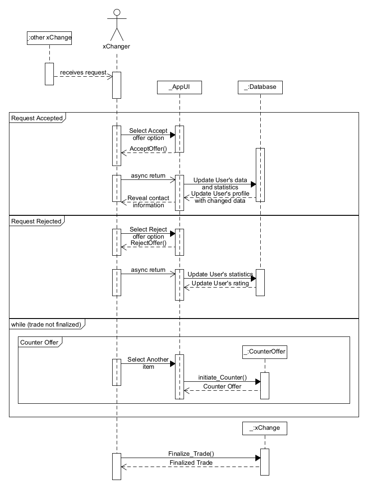

# Διάγραμμα Ακολουθίας για την Διαχείρηση μιας Ανταλλαγής Προϊόντων

Αυτό το διάγραμμα ακολουθίας περιγράφει τη διαδικασία ανταλλαγής προϊόντων στην εφαρμογή xChange, με τους xChangers να αλληλεπιδρούν για την αποδοχή, την αντιπροσφορά ή την απόρριψη μιας προσφοράς ανταλλαγής. Παρακάτω παρουσιάζεται η λεπτομερής περιγραφή της διαδικασίας:

1. **Έναρξη Συναλλαγής**
   - Η διαδικασία ξεκινά όταν ο xChanger1 καλεί τη συνάρτηση **initiateTransaction** για να ξεκινήσει η διαδικασία της ανταλλαγής με τον xChanger2.

2. **Τρεις Πιθανές Ενέργειες Κατά την Ανταλλαγή**
   - Από εδώ, υπάρχουν τρεις πιθανές ενέργειες που μπορεί να λάβει ο xChanger2:
     - α) **Αποδοχή Προσφοράς**
     - β) **Αντιπροσφορά**
     - γ) **Απόρριψη Προσφοράς**

   #### Στην Περίπτωση α) Αποδοχή Προσφοράς
   - Ο xChanger2 αποφασίζει να αποδεχτεί την προσφορά ανταλλαγής, καλώντας τη συνάρτηση **Accept Offer**, επιβεβαιώνοντας την πρόθεσή του να αποδεχτεί την ανταλλαγή.
   - Το σύστημα, ως απόκριση, αποκαλύπτει τις πληροφορίες επικοινωνίας των xChangers, επιτρέποντας την ολοκλήρωση της ανταλλαγής.
   - Στη συνέχεια, το σύστημα ενημερώνει το ιστορικό των συναλλαγών, τα στατιστικά στοιχεία και το προφίλ των χρηστών.

   #### Στην Περίπτωση β) Αντιπροσφορά
   - Ο xChanger2 αποφασίζει να κάνει αντιπροσφορά στον xChanger1, ζητώντας άλλο αντικείμενο.
   - Ο xChanger2 καλεί τη συνάρτηση **Request Another Item**, προτείνοντας μια νέα προσφορά.
   - Η διαδικασία επιστρέφει στον xChanger1, ο οποίος πρέπει να αποφασίσει αν θα αποδεχτεί ή θα απορρίψει την αντιπροσφορά.
   - Αυτός ο κύκλος μπορεί να συνεχιστεί μέχρι να επιτευχθεί συμφωνία ή να απορριφθεί η προσφορά.

   #### Στην Περίπτωση γ) Απόρριψη Προσφοράς
   - Ο xChanger2 αποφασίζει να απορρίψει την προσφορά ανταλλαγής.
   - Το σύστημα στη συνέχεια ενημερώνει το ιστορικό των συναλλαγών και τα στατιστικά στοιχεία του χρήστη.
   - Η ανταλλαγή τερματίζεται και η διαδικασία επιστρέφει στον xChanger1.

Με βάση το παραπάνω διάγραμμα ακολουθίας, η διαδικασία ανταλλαγής προσφέρει στους χρήστες τρεις βασικές επιλογές: την αποδοχή της προσφοράς, την υποβολή αντιπροσφοράς ή την απόρριψή της. Το σύστημα διαχειρίζεται τις διάφορες καταστάσεις ενημερώνοντας τα στατιστικά στοιχεία και το ιστορικό των χρηστών, διασφαλίζοντας ότι κάθε συναλλαγή καταγράφεται σωστά και οι χρήστες έχουν ευελιξία να διαπραγματευτούν την ανταλλαγή αντικειμένων τους.

