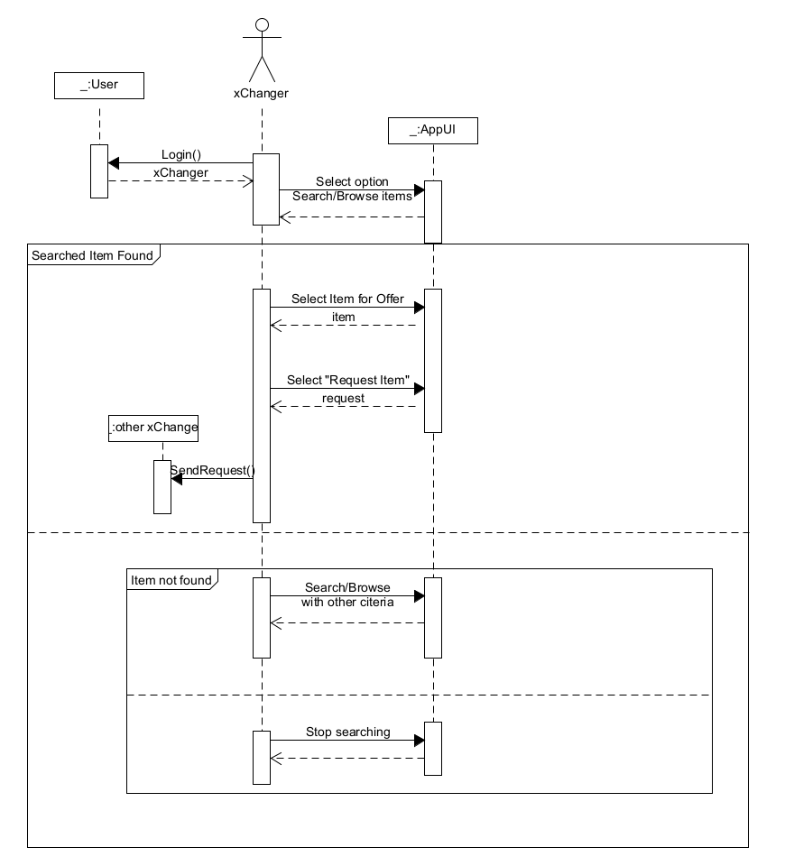

# Διάγραμμα Ακολουθίας για την Ανταλλαγή Προϊόντων

Αυτό το διάγραμμα ακολουθίας περιγράφει τη διαδικασία αναζήτησης και αιτήματος αντικειμένου στην εφαρμογή xChange, με τον χρήστη να αλληλεπιδρά με το σύστημα για να βρει, να προσφέρει και να ζητήσει ένα αντικείμενο για ανταλλαγή. Παρακάτω παρουσιάζεται η λεπτομερής περιγραφή της διαδικασίας:

1. **Σύνδεση Χρήστη**

   - Ο χρήστης εισάγει τα στοιχεία σύνδεσής του για να εισέλθει στην εφαρμογή.
   - Το σύστημα ελέγχει τα στοιχεία του χρήστη και ασύγχρονα επιτρέπει την είσοδό του, εφόσον εκείνα είναι σωστά.

1. **Αναζήτηση/Περιήγηση Αντικειμένων**

   - Ο xChanger1 περιηγείται ή αναζητά αντικείμενα που τον ενδιαφέρουν.
   - Το σύστημα επεξεργάζεται την αναζήτηση και επιστρέφει ασύγχρονα τα αποτελέσματα στον xChanger.

2. **Εντοπισμός Αντικειμένου**

   - Αν το επιθυμητό αντικείμενο βρεθεί, ο xChanger1 επιλέγει την ενέργεια **"Select Item for Offer"** για να το προσφέρει.
   - Το σύστημα ενημερώνει τον xChanger1 για την προσφορά.
   - Στη συνέχεια, ο xChanger1 επιλέγει την ενέργεια **"Request Item"** για να ζητήσει το αντικείμενο.
   - Το σύστημα ξεκινά τη διαδικασία **initiateTransaction** για να δρομολογήσει την ανταλλαγή.
   - Ο xChanger2 λαμβάνει το αίτημα και το σύστημα επιστρέφει ασύγχρονα την απόκριση στον xChanger1.

3. **Μη Εντοπισμός Αντικειμένου**

   - Αν δεν βρεθεί το επιθυμητό αντικείμενο, ο χρήστης έχει δύο επιλογές:
     - α) Να συνεχίσει την αναζήτηση με άλλα κριτήρια, επιλέγοντας **"Search/Browse with other criteria"**.
     - β) Να τερματίσει την αναζήτηση, επιλέγοντας **"Stop searching"**.
   - Το σύστημα επεξεργάζεται την επιλογή και επιστρέφει ασύγχρονα τα αποτελέσματα της νέας αναζήτησης ή τερματίζει την αναζήτηση.

Με βάση τα παραπάνω βήματα, η διαδικασία επιτρέπει στον χρήστη να αναζητήσει, να προσφέρει και να ζητήσει αντικείμενα, ή να προσαρμόσει τα κριτήρια αναζήτησης ή να σταματήσει την αναζήτηση, ανάλογα με τις προτιμήσεις του.

