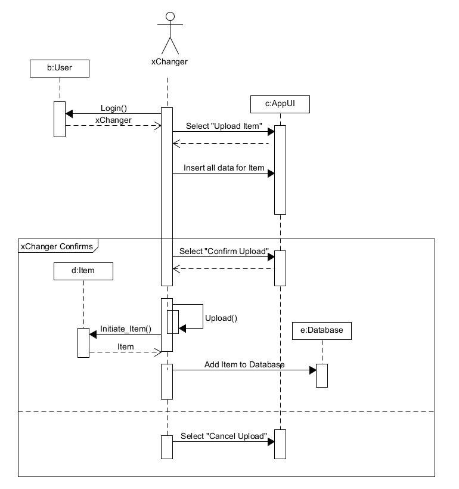

# Διάγραμμα Ακολουθίας για την Ανέβασμα Ενός Αντικειμένου στο xChange

Αυτό το διάγραμμα ακολουθίας περιγράφει τη διαδικασία ανέβασματος ενός αντικειμένου στην εφαρμογή xChange, με τον χρήστη να αλληλεπιδρά με το σύστημα για να καταχωρήσει και να επιβεβαιώσει ή να ακυρώσει την προσθήκη ενός αντικειμένου. Παρακάτω περιγράφονται τα βήματα της διαδικασίας:

1. **Σύνδεση Χρήστη**
   - Ο χρήστης εισάγει τα στοιχεία σύνδεσής του για να εισέλθει στην εφαρμογή.
   - Το σύστημα ελέγχει τα στοιχεία του χρήστη και επιτρέπει την είσοδό του, εφόσον εκείνα είναι σωστά.

2. **Επιλογή "Ανέβασμα Αντικειμένου"**
   - Ο xChanger επιλέγει στο σύστημα την επιλογή **"Ανέβασμα Αντικειμένου"**.
   - Το σύστημα επεξεργάζεται την επιλογή και επιστρέφει ασύγχρονα πίσω στον xChanger, ενημερώνοντάς τον ότι είναι έτοιμο για την εισαγωγή δεδομένων.

3. **Εισαγωγή Δεδομένων Αντικειμένου**
   - Ο xChanger καλείται να εισάγει στο σύστημα όλα τα δεδομένα του αντικειμένου (π.χ., Κατάσταση, Όνομα, Φωτογραφίες κλπ.).
   - Το σύστημα επεξεργάζεται τα δεδομένα και επιστρέφει ασύγχρονα πίσω στον xChanger, επιβεβαιώνοντας την εισαγωγή τους.

4. **Δύο Πιθανές Καταλήξεις**
   - Από εδώ και πέρα, υπάρχουν δύο πιθανές ενέργειες για τον xChanger:
     - α) **Επιβεβαίωση Ανεβάσματος**
     - β) **Ακύρωση Ανεβάσματος**

   #### Στην Περίπτωση α) Επιβεβαίωση Ανεβάσματος
   - Ο xChanger επιλέγει την **"Επιβεβαίωση Ανεβάσματος"** και καλεί τη συνάρτηση **upload**.
   - Η συνάρτηση **upload** στη συνέχεια καλεί τη συνάρτηση του αντικειμένου Ιtem **Initiate Item**, που δημιουργεί το αντικείμενο.
   - Η διαδικασία επιστρέφει στην **upload** και, αφού ολοκληρωθεί η διαδικασία δημιουργίας του αντικειμένου, η καταχώρηση ολοκληρώνεται επιτυχώς.
   - Το αντικείμενο καταχωρείται στη βάση δεδομένων και η διαδικασία επιστρέφει πίσω στον xChanger.

   #### Στην Περίπτωση β) Ακύρωση Ανεβάσματος
   - Ο xChanger επιλέγει την **"Ακύρωση Ανεβάσματος"**, και το ανέβασμα διακόπτεται.
   - Η διαδικασία επιστρέφει στον xChanger χωρίς να πραγματοποιηθεί καμία άλλη λειτουργία.

Με βάση τα παραπάνω βήματα, η διαδικασία επιτρέπει στον χρήστη να ανεβάσει ένα αντικείμενο στο σύστημα ή να ακυρώσει τη διαδικασία, παρέχοντας ευελιξία στον έλεγχο του ανεβάσματος. Ανάλογα με την επιλογή του χρήστη, το αντικείμενο μπορεί είτε να καταχωρηθεί στη βάση δεδομένων είτε να ακυρωθεί χωρίς περαιτέρω ενέργειες.

