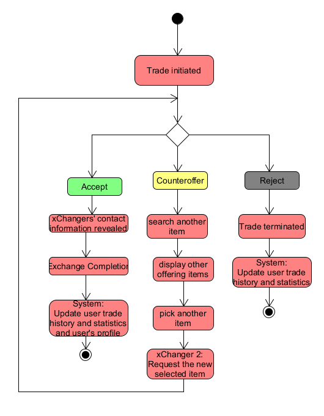

# Περίπτωση Χρήσης: Τροποποίηση αιτημάτων - Αίτημα Αντιπροσφοράς

**Πρωτεύων Actor**: xChanger (Χρήστης)  
**Ενδιαφερόμενοι**
**xChanger-2**: ο χρήστης έχει λάβει αίτημα από έναν άλλο χρήστη για το προιόν του.Επίσης του έχει προσφερθεί απο τον εκάστοτε χρήστη ένα προιόν.    
**Προϋποθέσεις**: Ο χρήστης έχει λάβει με επιτυχία αίτημα από έναν άλλον χρήστη.    

# Βασική Ροή Διαγράμματος Ανταλλαγής

1. **Trade Initiated** (Ο χρήστης έχει λάβει ένα αίτημα ανταλλαγής)

2. Επιλογές:

   - ### Accept (Αποδοχή)
     - Αποκαλύπτονται τα στοιχεία επικοινωνίας που έχει ορίσει ο κάθε xChanger προκειμένου να επικοινωνήσουν για το πώς θα ανταλλάξουν τα προιόντα.
     - Ολοκλήρωση ανταλλαγής με την συμφωνία και των δύο πλευρών.
     - Το σύστημα ενημερώνει:
       - Ιστορικό συναλλαγών για κάθε χρήστη
       - Στατιστικά του χρήστη για επιτυχημενές ανταλλαγές και ακτηγορία προιόντων που πήρε και αντάλλαξε.
       - Προφίλ χρήστη για αφαίρεση του αντικειμένου που μόλις αντάλλαξε και για την κριτική, εάν και εφόσον έλαβε.

   - ### Counteroffer (Αντιπροσφορά)
     - Ο xChanger 2 ζητά άλλο αντικείμενο/α.
     - Η διαδικασία επιστρέφει στην αρχή και επαναλαμβάνεται μέχρι να γίνει:
       - Αποδοχή (Accept)
       - Απόρριψη (Reject)

   - ### Reject (Απόρριψη)
     - Τερματισμός της ανταλλαγής, καθώς οι χρήστες δεν συμφώνησαν στους όρους ανταλλαγής, ή συνέβη κάτι απρόσμενο.
     - Το σύστημα ενημερώνει:
       - Ιστορικό συναλλαγών για κάθε χρήστη.
       - Στατιστικά του χρήστη για αποτυχημένες ανταλλαγές.
       - Προφίλ χρήστη για κριτική, εάν και εφόσον πήρε.

    ## Εναλλακτικές ροές ##
    1. Ο χρήστης που στέλνει το αίτημα το ακυρώνει πριν ο χρήστης 2 προλάβει να απαντήσει.
    2. Κάποιος από τους χρήστες λάβει κάποιο αίτημα από τρίτο χρήστη και αποφασίζει να διακόψει την ανταλλαγή.  
   

   ## Επιχειρησιακοί Κανόνες
   - Ο χρήστης είναι υπεύθυνος για την ακρίβεια των πληροφοριών του αντικειμένου.
   - Η πλατφόρμα διατηρεί το δικαίωμα να απορρίψει αντικείμενα με ακατάλληλο περιεχόμενο.

   ##  Διάγραμμα δραστηριότητας
    Παρακάτω ακολούθει το αναλυτικό διάγραμμα που συνοψίζει όλα τα προαναφερθέντα.

